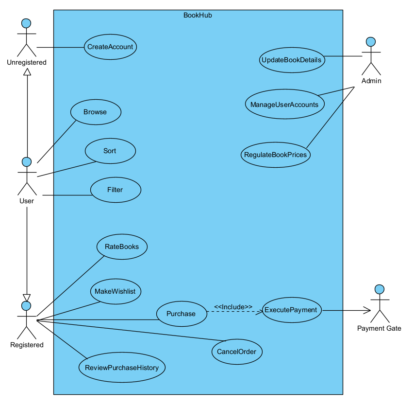
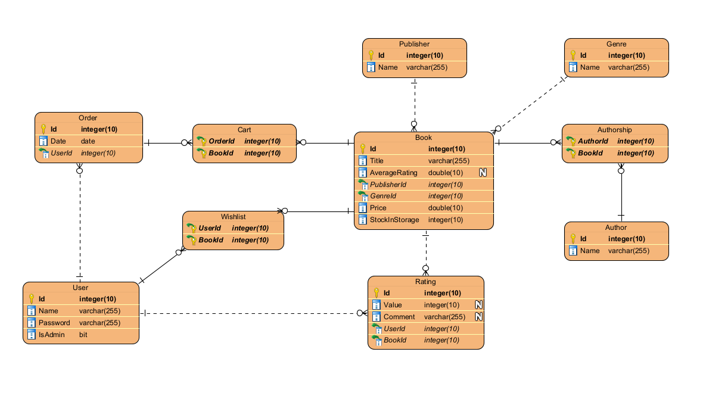

# PV179-BookHub


## Overview

BookHub is a comprehensive digital platform designed for the BookHub company, a renowned seller of books across various genres. The application facilitates easy browsing and purchasing of books, allowing customers to sort and filter by authors, publishers, and genres. Built using ASP.NET Core and Entity Framework Core, it provides a robust and efficient system for managing books, authors, publishers, and user ratings.
## Features

- Book Management: Enables users to browse, purchase, and view books. Each book has properties like name, price, stock in storage, overall rating, genres, publisher, and authors.
- Author and Publisher Management: Provides administrative privileges to view, add, update, and delete authors and publishers.
- User Account Management: Allows customers to create accounts, review their purchase history, rate books, and create wishlists.
- Rating Management: Facilitates users to rate books and leave comments. The rating value and comments can be updated.

## Use Case Diagram


## Architecture
The application is built using ASP.NET Core as the framework, which is a cross-platform framework for building modern cloud-based internet connected applications like web apps, IoT apps, and mobile backends. It uses Entity Framework Core as the Object-Relational Mapper (ORM) to handle database operations.

## Components
The application has several components each handling a specific functionality:

- Book Management: This component is responsible for all operations related to books. It allows users to view, add, update, and delete books. Each book has properties like name, price, stock in storage, overall rating, genres, publisher, and authors.
- Author and Publisher Management: This component handles all operations related to authors and publishers. It allows users to view, add, update, and delete authors and publishers.
- Rating Management: This is where users can rate books and leave comments. The rating value and comments can be updated.
- Request Logging: All requests to the application are logged with details like the request method and path. The logs are stored in a text file.

## Data Flow
When a user interacts with the application, the request is first logged by the Request Logging component. Then, depending on the request, it's routed to the appropriate component. For instance, if a user wants to update a book's details, the request is handled by the Book Management component. After processing the request, the updated data is stored in the database using Entity Framework Core.

## Database Schema


## Setup and Installation

1. Clone the repository to your local machine.
2. Navigate to the project directory.
3. Install the required dependencies using the command dotnet restore.
4. Build the project using the command dotnet build.
5. Run the project using the command dotnet run.
```
cd project_directory
git remote add origin https://gitlab.fi.muni.cz/xmarianc/pv179-bookhub.git
git branch -M main
git push -uf origin main
```

## Usage
The application exposes several endpoints for interacting with the books, authors, publishers, and ratings. Here are some examples:
- GET /Books: Fetches a list of all books.
- POST /Books: Adds a new book.
- PUT /UpdateBook/{id}: Updates the details of a book with the given ID.
- DELETE /Books/{id}: Deletes the book with the given ID.

Similar endpoints are available for authors, publishers, and ratings.

## Deployment
The code for the application will be made available for retrieval after the completion of the "Milestone 2" phase, enabling deployment on the test server. The code should be obtained exclusively from the master branch, ensuring its reliability and stability.
***